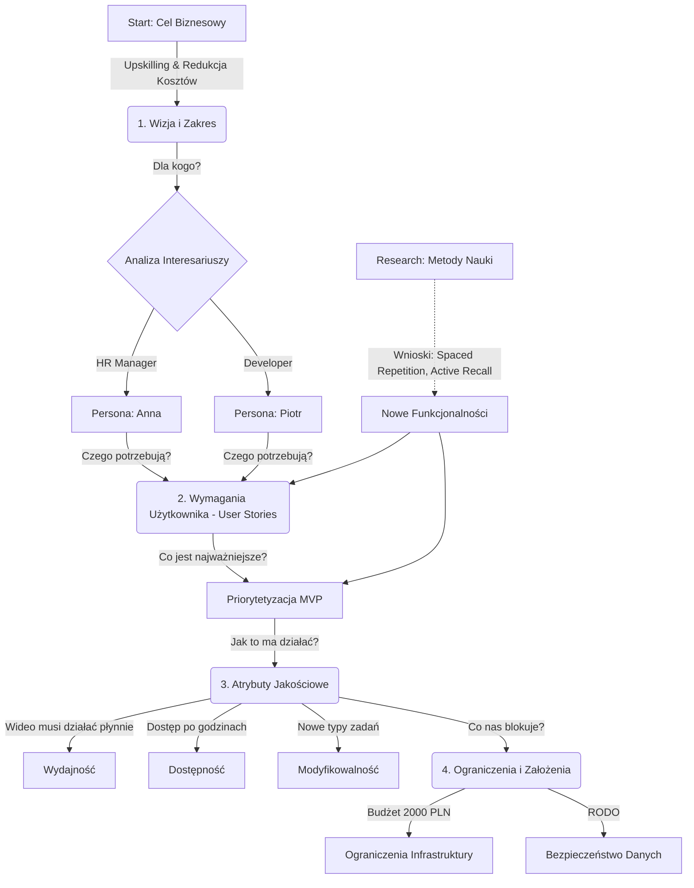

# Proces Powstawania Dokumentacji Architektonicznej (Mapa Myśli)

Poniższy dokument opisuje iteracyjny proces, który doprowadził do powstania rozwiązania. Każdy etap wynikał z poprzedniego, tworząc spójną całość.

## Wizualizacja Procesu (Mermaid)

## Opis Krok po Kroku

### Krok 1: Zrozumienie Celu (Start)
Wszystko zaczęło się od Twojego celu biznesowego: **"Przeszkolenie 60% kadry technicznej... redukując wydatki o 200 tys. PLN"**. To było ziarno, z którego wyrosła reszta.
*   **Decyzja:** System musi być LMS-em (Learning Management System), a nie np. platformą rekrutacyjną.

### Krok 2: Określenie Odbiorców (Persony)
Aby system był użyteczny, musieliśmy zrozumieć, kto będzie z niego korzystał.
*   **Anna (HR):** Potrzebuje raportów, aby udowodnić realizację celu (KPI). -> Stąd wymaganie **[US-5] Raportowanie**.
*   **Piotr (Dev):** Potrzebuje konkretnej wiedzy, a nie "lania wody". -> Stąd wymaganie **[US-1] Ścieżki Rozwoju**.

### Krok 3: Definiowanie Funkcji (Wymagania)
Na podstawie potrzeb person stworzyliśmy listę funkcji (User Stories).
*   Początkowo były to standardowe funkcje LMS (katalog, wideo, quizy).

### Krok 4: Wzbogacenie o Research (Iteracja)
To był kluczowy moment. Zamiast poprzestać na standardzie, zrobiliśmy research "Jak ludzie się uczą?".
*   **Odkrycie:** Samo oglądanie wideo jest mało skuteczne.
*   **Akcja:** Dodaliśmy **[US-7] Asystenta Powtórek** i **[US-8] Interaktywne Wideo**.
*   **Wynik:** Rozwiązanie stało się innowacyjne i naukowo uzasadnione.

### Krok 5: Priorytetyzacja (MVP)
Nie da się zrobić wszystkiego naraz. Użyliśmy macierzy (Wartość / Koszt).
*   **Decyzja:** "Wirtualne Laboratoria" są super, ale zbyt drogie na start -> Backlog.
*   **Decyzja:** "Interaktywne Wideo" jest droższe niż zwykłe, ale daje ogromną wartość edukacyjną -> Wchodzi do MVP.

### Krok 6: Jakość i Ograniczenia (Architektura)
Skoro mamy wideo (wymaganie), to system musi być **Wydajny** (atrybut).
Skoro przechowujemy wyniki pracowników, to musimy dbać o **RODO** (ograniczenie).
Skoro mamy mały budżet, to musimy użyć taniej chmury (ograniczenie).

W ten sposób każdy element dokumentacji wynika logicznie z poprzedniego, tworząc spójną architekturę.
