# Specyfikacja Wymagań Oprogramowania (SRS)

**Tytuł Projektu:** Intelligent LMS
**Wersja:** 0.1.0
**Zespół:** Zespół Projektowy ZPI

---

## 1. Wstęp

### 1.1. Cel
Celem niniejszego dokumentu jest zdefiniowanie wymagań funkcjonalnych i niefunkcjonalnych dla systemu "Intelligent LMS". Dokument ten służy jako podstawa do prac projektowych, implementacyjnych oraz testowych. Jest przeznaczony dla zespołu deweloperskiego, kierowników projektu oraz interesariuszy biznesowych (CTO, HR).

### 1.2. Wizja, Zakres i Cele Produktu
**Wizja:**
Stworzenie inteligentnej platformy rozwojowo-benefitowej LMS (Learning Management System), która przekształca organizację w środowisko ciągłego uczenia się ("Learning Organization"), gdzie każdy pracownik ma dostęp do spersonalizowanej ścieżki rozwoju (Learning Path) bezpośrednio powiązanej z celami biznesowymi firmy oraz elastycznym systemem nagród.
Każda ścieżka rozwoju będzie bezpośrednio powiązana z celami firmy poprzez mechanizm OKR (Objectives and Key Results). System umożliwi kaskadowanie celów od poziomu strategicznego do celów indywidualnych, wizualizację drzewa celów oraz kwartalną weryfikację realizacji strategii.

**Zakres:**
System będzie umożliwiał zarządzanie ścieżkami rozwoju, przydzielanie kursów, weryfikację wiedzy poprzez quizy, raportowanie postępów oraz obsługę wirtualnego portfela punktowego. Kluczowym elementem jest platforma kafeteryjna, zintegrowana z dostawcami usług zewnętrznych, umożliwiająca wymianę punktów na benefity rozwojowe i prozdrowotne.

System będzie również wspierał definiowanie, kaskadowanie i monitorowanie celów OKR, wymuszając hierarchiczną strukturę danych, zapewniając mechanizmy wizualizacji drzewa celów oraz analitykę postępów powiązaną z celami biznesowymi.

**Kryteria Akceptacji (KPIs):**
*   **Upskilling:** Przeszkolenie 60% kadry technicznej z nowych technologii w ciągu 12 miesięcy.
*   **Oszczędność:** Redukcja wydatków na zewnętrznych konsultantów o 200 tys. PLN rocznie.
*   **Zaangażowanie:** Wskaźnik ukończenia kursów na poziomie > 85%.
*   **Optymalizacja Budżetu:** zwiększenie utylizacji budżetu szkoleniowo-benefitowego do 95% (z obecnych 60%) w ciągu 12 miesięcy poprzez wdrożenie platformy kafeteryjnej.

**Cele Biznesowe (OKR):**
*   **Zarządzanie przez cele (OKR):** Zapewnienie 100% transparentności powiązań między celami indywidualnymi a strategią firmy w ciągu 3 miesięcy, poprzez system kaskadowania celów OKR, co pozwoli na kwartalną weryfikację realizacji strategii. (Wymusza hierarchiczną strukturę danych, wizualizację drzewa celów i analitykę postępów.)

**Poza Zakresem:**
System nie będzie obsługiwał płatności za kursy (wszystkie materiały są wewnętrzne lub opłacone ryczałtem) ani rekrutacji nowych pracowników.

### 1.3. Definicje, Akronimy i Skróty
*   **LMS (Learning Management System):** System zarządzania nauczaniem.
*   **Learning Path:** Zorganizowana sekwencja kursów i materiałów mająca na celu rozwój konkretnych kompetencji.
*   **Active Recall:** Metoda nauki polegająca na aktywnym przywoływaniu informacji (np. odpowiadanie na pytania w trakcie wideo).
*   **Spaced Repetition:** Metoda nauki oparta na powtórkach rozłożonych w czasie.
*   **KPI (Key Performance Indicator):** Kluczowy wskaźnik efektywności.
*   **System Kafeteryjny:** Model benefitów pozwalający pracownikowi na samodzielny wybór świadczeń z udostępnionej puli usług.
*   **Portfel Wirtualny:** Moduł zarządzający saldem punktów pracownika, zdobytych za aktywność edukacyjną.

### 1.4. Przegląd Dokumentu
Dokument składa się z 7 rozdziałów. Po wstępie (Rozdział 1), Rozdział 2 przedstawia ogólny opis systemu, w tym charakterystykę użytkowników. Rozdział 3 definiuje wymagania interfejsów. Kluczowy Rozdział 4 szczegółowo opisuje wymagania funkcjonalne w formacie User Stories. Rozdział 5 to wymagania niefunkcjonalne. Rozdział 6 zawiera analizę porównawczą, a Rozdział 7 dodatki, w tym diagramy.

---

## 2. Opis Ogólny

### 2.1. Główne Funkcje Produktu
System Intelligent LMS składa się z następujących głównych modułów funkcjonalnych:

*   **Zarządzanie Ścieżkami Rozwoju (Learning Paths):** Tworzenie i edycja ścieżek edukacyjnych.
*   **Katalog Kursów:** Przeglądanie i wyszukiwanie dostępnych szkoleń.
*   **Moduł Odtwarzania (Player):** Odtwarzanie wideo, w tym wideo interaktywnego (Active Recall).
*   **Weryfikacja Wiedzy:** Moduł quizów i testów sprawdzających.
*   **Inteligentny Asystent Powtórek:** System Spaced Repetition sugerujący powtórki.
*   **Raportowanie i Analityka:** Generowanie raportów dla managerów i HR.
*   **Wirtualny Portfel i Silnik Kafeteryjny:** Moduł transakcyjny zarządzający punktami. Odpowiada za przeliczanie postępów w nauce na jednostki płatnicze i ich wymianę wewnątrz Marketplace.
*   **Zaawansowana Analityka Budżetowa:** Monitorowanie wskaźników utylizacji budżetu (KPI: 95%) oraz efektywności kosztowej programów rozwojowych.
*   **Moduł Integracji Zewnętrznych:** Automatyczna komunikacja z dostawcami usług (np. generowanie voucherów w systemach partnerów).

### 2.2. Klasy Użytkowników

**Rola:** HR Manager / Administrator
*   **Opis:** Zarządza budżetem, użytkownikami, ścieżkami szkoleniowymi i ofertą świadczonych usług. Monitoruje postępy.
*   **Persona:** **Anna (35 lat)**. Cel: Chce efektywnie zarządzać budżetem szkoleniowym. Chce widzieć pełny obraz zwrotu z inwestycji (ROI) oraz zautomatyzować proces wydawania benefitów, by uniknąć pracy w arkuszach kalkulacyjnych. Frustracja: Brak weryfikacji efektów szkoleń. Traci 5 godzin tygodniowo na przepisywanie punktów z systemu szkoleń do arkusza zamówień benefitów.

**Rola:** Pracownik / Developer
*   **Opis:** Korzysta z systemu do nauki, realizuje przypisane ścieżki.
*   **Persona:** **Piotr (29 lat)**. Senior Developer. Cel: Chce pogłębiać wiedzę techniczną bez tracenia czasu na szukanie materiałów. Chce rozwijać kompetencje techniczne i mieć realny wpływ na wybór swoich benefitów (wellness/rozwój) w ramach zdobytych punktów. Frustracja: Niespójne źródła wiedzy. Dostał kolejną kartę sportową, z której nie korzysta, a wolałby dofinansowanie do ergonomicznego fotela lub sesję z trenerem kręgosłupa.

**Rola:** Manager Zespołu
*   **Opis:** Przypisuje ścieżki podwładnym i monitoruje ich rozwój w kontekście potrzeb projektowych. Monitoruje rozwój i wellbeing podwładnych.

### 2.3. Ograniczenia Projektowe i Implementacyjne

1.  **Ograniczenie budżetowe (Infrastruktura):**
    *   **Treść:** Miesięczny koszt utrzymania infrastruktury chmurowej nie może przekroczyć 2000 PLN w fazie MVP.
    *   **Wpływ:** Wymusza optymalizację przechowywania wideo (np. kompresja) i dobór efektywnych kosztowo usług (np. serverless dla rzadziej używanych funkcji).

2.  **Ograniczenie technologiczne (Integracje):**
    *   **Treść:** Konieczność obsługi zewnętrznych interfejsów dostawców usług benefitowych (np. bramki voucherowe) o różnej charakterystyce.
    *   **Wpływ:** System musi implementować wzorce odporności (Retry, Circuit Breaker) i nie może polegać na synchronicznych odpowiedziach wszystkich dostawców (wymagane kolejki zadań).

3.  **Ograniczenie prawne (RODO):**
    *   **Treść:** System przetwarza dane osobowe i wyniki pracowników.
    *   **Wpływ:** Konieczność implementacji ścisłych ról dostępu (ACL), szyfrowania danych w spoczynku i w transmisji oraz pełnych logów audytowych dostępu do danych.

4.  **Ograniczenie organizacyjne (Dostawcy):**
    *   **Treść:** Dostępność usług w Marketplace zależy od podpisanych umów z partnerami zewnętrznymi.
    *   **Wpływ:** Katalog benefitów musi być dynamiczny i pozwalać na szybkie wyłączanie niedostępnych usług przez administratora bez wdrażania zmian w kodzie.

### 2.4. Założenia Projektowe

1.  **Założenie:** Dostępność Materiałów.
    *   **Treść:** Dział HR dostarczy gotowe wideo i quizy przed startem systemu.
    *   **Ryzyko:** Jeśli materiały nie będą gotowe, platforma będzie pusta ("Ghost Town").
    *   **Walidacja:** Weryfikacja stanu materiałów na 2 tygodnie przed startem MVP.

2.  **Założenie:** Przepustowość Sieci.
    *   **Treść:** Sieć biurowa wytrzyma obciążenie przy jednoczesnym streamingu wideo przez wielu pracowników.
    *   **Ryzyko:** Zator sieci, buforowanie wideo, frustracja użytkowników.
    *   **Walidacja:** Testy obciążeniowe sieci wewnętrznej przed wdrożeniem.

3.  **Założenie:** Dostępność API.
    *   **Treść:** Zakłada się, że kluczowi dostawcy benefitów udostępniają stabilne środowiska API do integracji.
    *   **Ryzyko:** Brak API lub niska jakość dokumentacji opóźni integrację.
    *   **Walidacja:** Prototypowanie integracji (PoC) z kluczowymi dostawcami w fazie analizy.

4.  **Założenie:** Hybrydowa Realizacja.
    *   **Treść:** Realizacja usług cyfrowych (kody) jest natychmiastowa, a fizycznych może wymagać potwierdzenia manualnego.
    *   **Ryzyko:** Niezadowolenie użytkowników z czasu oczekiwania na benefity fizyczne.
    *   **Walidacja:** Jasna komunikacja czasu realizacji (SLA) w interfejsie użytkownika przy każdym beneficie.

---

## 3. Wymagania Dotyczące Interfejsów Zewnętrznych

### 3.1. Interfejsy Użytkownika (UI)
Aplikacja będzie posiadać interfejs webowy (SPA) zaprojektowany zgodnie z zasadami **Material Design**. Priorytetem jest czytelność i intuicyjność (User-Friendly).
System musi być responsywny (RWD) i obsługiwać urządzenia mobilne oraz desktopowe.

**Główne widoki:**

1.  **Dashboard użytkownika (Moje Ścieżki):**
    

2.  **Katalog Kursów (Wyszukiwarka):**
    

3.  **Odtwarzacz Wideo z panelem bocznym:**
    

### 3.2. Interfejsy Programowe (API)
System będzie komunikował się z zewnętrznymi systemami:

1.  **System HR (ERP):**
    *   **Cel:** Pobieranie i aktualizacja listy pracowników, struktury organizacyjnej i stanowisk.
    *   **Protokół:** REST API / JSON.
    *   **Częstotliwość:** Synchronizacja nocna (Batch).

2.  **System Uwierzytelniania (SSO):**
    *   **Cel:** Logowanie pracowników firmowym kontem.
    *   **Protokół:** OAuth 2.0 / OpenID Connect (Azure AD).

---

## 4. Wymagania Funkcjonalne

### 4.1. [US-1] Przeglądanie Katalogu

* **Tytuł:** Przeglądanie katalogu dostępnych ścieżek rozwoju
* **Opis:** Umożliwia pracownikom przeglądanie i filtrowanie dostępnych ścieżek rozwoju (Learning Paths).
* **Historyjka Użytkownika:**
    * Jako pracownik,
    * chcę przeglądać katalog dostępnych ścieżek rozwoju,
    * abym mógł wybrać te zgodne z moimi zainteresowaniami.
* **Cel Biznesowy:** Zwiększenie zaangażowania pracowników w samorozwój poprzez łatwy dostęp do oferty szkoleniowej.
* **Warunki Wstępne:** Użytkownik jest zalogowany do systemu.
* **Warunki Końcowe:** Użytkownik widzi listę ścieżek przefiltrowaną według swoich kryteriów.
* **Kryteria Akceptacji:**

    * **WF-KAT-01: Wyświetlenie katalogu (Scenariusz Główny)**
        * *Opis:* Pracownik wchodzi do sekcji katalogu i widzi dostępne kursy.
        * *Kryteria Akceptacji:*
            * **Given:** Jestem zalogowanym pracownikiem.
            * **When:** Wchodzę w zakładkę "Katalog".
            * **Then:** Widzę listę kafelków z nazwami ścieżek, poziomem trudności i czasem trwania.

    * **WF-KAT-02: Brak wyników wyszukiwania (Scenariusz Alternatywny)**
        * *Opis:* Pracownik szuka frazy, która nie pasuje do żadnego kursu.
        * *Kryteria Akceptacji:*
            * **Given:** Jestem w katalogu kursów.
            * **When:** Wpisuję w wyszukiwarkę frazę "Programowanie w COBOL", której nie ma w bazie.
            * **Then:** Lista kursów jest pusta.
            * **And:** Wyświetla się komunikat "Nie znaleziono kursów dla podanej frazy".
            * **And:** System sugeruje "Wyczyść filtry" lub "Zgłoś zapotrzebowanie na kurs".

    * **WF-KAT-03: Dostęp do ścieżek dedykowanych (Widok Managera)**
        * *Opis:* Manager przegląda katalog w celu znalezienia ścieżek do przypisania zespołowi.
        * *Kryteria Akceptacji:*
            * **Given:** Jestem zalogowany jako Manager Zespołu.
            * **When:** Przeglądam katalog kursów.
            * **Then:** Widzę oznaczenia przy kursach "Rekomendowane dla Twojego zespołu".
            * **And:** Mam dostęp do przycisku "Przypisz do zespołu" bezpośrednio z widoku kafelka.

### 4.2. [US-2] Przypisywanie Ścieżek

* **Tytuł:** Przypisywanie ścieżek rozwoju podwładnym
* **Opis:** Umożliwia Managerowi przypisanie konkretnej ścieżki rozwoju swojemu podwładnemu.
* **Historyjka Użytkownika:**
    * Jako Manager,
    * chcę przypisać konkretną ścieżkę rozwoju mojemu podwładnemu,
    * aby ukierunkować jego rozwój na potrzeby projektu.
* **Cel Biznesowy:** Zamykanie luk kompetencyjnych w zespole zgodnie ze strategią firmy.
* **Warunki Wstępne:** Manager jest zalogowany i ma przypisanych członków zespołu.
* **Warunki Końcowe:** Ścieżka zostaje dodana do "Moich Ścieżek" pracownika z oznaczeniem "Wymagana".
* **Kryteria Akceptacji:**

    * **WF-ASSIGN-01: Przypisanie ścieżki (Scenariusz Główny)**
        * *Opis:* Manager wybiera pracownika i przypisuje mu nową ścieżkę.
        * *Kryteria Akceptacji:*
            * **Given:** Jestem Managerem na profilu pracownika.
            * **When:** Kliknę "Przypisz Ścieżkę" i wybiorę z listy "Java Advanced".
            * **Then:** Pracownik otrzymuje powiadomienie e-mail.
            * **And:** Ścieżka jest widoczna na koncie pracownika jako "Wymagana".

    * **WF-ASSIGN-02: Próba przypisania już posiadanej ścieżki (Scenariusz Wyjątkowy)**
        * *Opis:* System blokuje możliwość przypisania ścieżki, którą pracownik już realizuje.
        * *Kryteria Akceptacji:*
            * **Given:** Jestem na profilu pracownika, który ma już przypisaną ścieżkę "Java Advanced".
            * **When:** Próbuję ponownie przypisać tę samą ścieżkę.
            * **Then:** Przycisk/opcja wyboru tej ścieżki jest nieaktywna (wyszarzona).
            * **Or:** System wyświetla komunikat błędu "Użytkownik już realizuje tę ścieżkę".
            * **And:** Nie wysyła się duplikat powiadomienia.

    * **WF-ASSIGN-03: Odbiór przypisania (Perspektywa Pracownika)**
        * *Opis:* Pracownik widzi nowo przypisaną ścieżkę w swoim panelu.
        * *Kryteria Akceptacji:*
            * **Given:** Manager przypisał mi ścieżkę "Security Basics".
            * **When:** Loguję się do systemu jako Pracownik.
            * **Then:** Na dashboardzie w sekcji "Wymagane" widzę nową pozycję.
            * **And:** Otrzymuję powiadomienie wewnątrz aplikacji "Nowe zadanie od przełożonego".

### 4.3. [US-3, US-8] Odtwarzanie i Interakcja z Wideo

* **Tytuł:** Odtwarzanie wideo z aktywnym przywoływaniem wiedzy (Active Recall)
* **Opis:** Umożliwia pracownikom oglądanie materiałów szkoleniowych i odpowiadanie na pytania w trakcie wideo.
* **Historyjka Użytkownika:**
    * Jako pracownik,
    * chcę odpowiadać na pytania w trakcie oglądania wideo,
    * aby na bieżąco weryfikować zrozumienie materiału.
* **Cel Biznesowy:** Zwiększenie retencji wiedzy poprzez interakcję (Active Recall) w trakcie nauki.
* **Warunki Wstępne:** Użytkownik uruchomił materiał wideo w odtwarzaczu.
* **Warunki Końcowe:** Postęp wideo oraz odpowiedzi na pytania zostają zapisane w systemie.
* **Kryteria Akceptacji:**

    * **WF-VIDEO-01: Interakcja Active Recall (Scenariusz Główny)**
        * *Opis:* Wideo zatrzymuje się w określonym momencie i wymusza odpowiedź na pytanie.
        * *Kryteria Akceptacji:*
            * **Given:** Oglądam wideo szkoleniowe.
            * **When:** Wideo dociera do znacznika czasu z przypisanym pytaniem.
            * **Then:** Odtwarzanie jest pauzowane automatycznie.
            * **And:** Na ekranie pojawia się pytanie wielokrotnego wyboru.
            * **And:** Nie mogę wznowić odtwarzania bez udzielenia odpowiedzi.

    * **WF-VIDEO-02: Błąd ładowania wideo (Scenariusz Wyjątkowy)**
        * *Opis:* Obsługa sytuacji, gdy materiał wideo nie może zostać załadowany.
        * *Kryteria Akceptacji:*
            * **Given:** Próbuję otworzyć materiał wideo.
            * **When:** Występuje problem z połączeniem internetowym lub serwerem plików.
            * **Then:** Odtwarzacz wyświetla komunikat "Nie można załadować materiału. Sprawdź połączenie.".
            * **And:** Pojawia się przycisk "Spróbuj ponownie".
            * **And:** Postęp oglądania nie jest tracony (ostatnia znana pozycja jest zachowana lokalnie).

    * **WF-VIDEO-03: Podgląd postępów wideo (Perspektywa Managera)**
        * *Opis:* Manager sprawdza, czy pracownik obejrzał materiał wideo.
        * *Kryteria Akceptacji:*
            * **Given:** Pracownik obejrzał 50% materiału wideo.
            * **When:** Jako Manager wchodzę w "Szczegóły postępów" pracownika.
            * **Then:** Widzę pasek postępu przy danym materiale wideo (50%).
            * **And:** Widzę informację o dacie ostatniej aktywności.

### 4.4. [US-4] Weryfikacja Wiedzy - Quiz

* **Tytuł:** Rozwiązywanie testu sprawdzającego po module
* **Opis:** Umożliwia weryfikację wiedzy zdobytej w danym module poprzez test (Quiz).
* **Historyjka Użytkownika:**
    * Jako pracownik,
    * chcę rozwiązać test sprawdzający po module,
    * aby potwierdzić zdobyte umiejętności i zaliczyć kurs.
* **Cel Biznesowy:** Potwierdzenie nabycia kompetencji i automatyczna ocena postępów.
* **Warunki Wstępne:** Użytkownik ukończył wszystkie materiały wideo w danym module.
* **Warunki Końcowe:** Wynik testu jest zapisany, a status modułu zaktualizowany.
* **Kryteria Akceptacji:**

    * **WF-QUIZ-01: Zaliczenie testu (Scenariusz Główny)**
        * *Opis:* Użytkownik uzyskuje wynik pozytywny i zalicza moduł.
        * *Kryteria Akceptacji:*
            * **Given:** Ukończyłem oglądanie materiałów w module.
            * **When:** Przystępuję do quizu i uzyskuję wynik > 80%.
            * **Then:** Moduł otrzymuje status "Zaliczony".
            * **And:** System gratuluje sukcesu i odblokowuje kolejny moduł (jeśli istnieje).

    * **WF-QUIZ-02: Niezaliczenie testu (Scenariusz Alternatywny)**
        * *Opis:* Użytkownik uzyskuje wynik poniżej progu zaliczenia.
        * *Kryteria Akceptacji:*
            * **Given:** Ukończyłem materiały i przystąpiłem do quizu.
            * **When:** Uzyskuję wynik < 80% (np. 65%).
            * **Then:** System wyświetla informację "Test niezaliczony. Spróbuj ponownie.".
            * **And:** Wskazuje sekcje materiału/wideo, które warto powtórzyć przed kolejną próbą.
            * **And:** Moduł pozostaje w statusie "W toku".

    * **WF-QUIZ-03: Walidacja pytań (Perspektywa Autora/Admina)**
        * *Opis:* System wykrywa błędnie skonfigurowane pytania (bez poprawnej odpowiedzi).
        * *Kryteria Akceptacji:*
            * **Given:** Jestem autorem kursu (HR/Tech Lead).
            * **When:** Próbuję zapisać quiz, w którym jedno z pytań nie ma zaznaczonej poprawnej odpowiedzi.
            * **Then:** System blokuje zapis.
            * **And:** Wyświetla komunikat błędu "Każde pytanie musi mieć co najmniej jedną poprawną odpowiedź".

### 4.5. [US-5] Raportowanie Postępów

* **Tytuł:** Generowanie raportów postępów zespołów
* **Opis:** Umożliwia HR Managerowi generowanie zestawień statystycznych dotyczących postępów w nauce.
* **Historyjka Użytkownika:**
    * Jako HR Manager,
    * chcę generować raporty postępów zespołów,
    * aby monitorować realizację celu 60% przeszkolonej kadry.
* **Cel Biznesowy:** Monitoring kluczowych wskaźników efektywności (KPI) i weryfikacja ROI szkoleń.
* **Warunki Wstępne:** W systemie są zarejestrowane dane o postępach użytkowników.
* **Warunki Końcowe:** Wygenerowany plik raportu jest dostępny do pobrania.
* **Kryteria Akceptacji:**

    * **WF-REPORT-01: Generowanie raportu (Scenariusz Główny)**
        * *Opis:* HR Manager pobiera raport dla wybranego zespołu i zakresu czasu.
        * *Kryteria Akceptacji:*
            * **Given:** Jestem zalogowany jako HR Manager.
            * **When:** Wybieram zakres dat i zespół, a następnie klikam "Generuj Raport".
            * **Then:** System przetwarza dane o ukończonych kursach.
            * **And:** Pobieram wygenerowany plik (CSV/PDF) z raportem.

    * **WF-REPORT-02: Brak danych do raportu (Scenariusz Alternatywny)**
        * *Opis:* Obsługa sytuacji, gdy filtrowanie nie zwraca żadnych wyników.
        * *Kryteria Akceptacji:*
            * **Given:** Wybrałem zakres dat lub zespół, który nie ma zarejestrowanych aktywności.
            * **When:** Klikam "Generuj Raport".
            * **Then:** System wyświetla komunikat "Brak danych dla wybranych kryteriów".
            * **And:** Nie generuje pustego pliku.

    * **WF-REPORT-03: Automatyczna wysyłka raportu (Perspektywa Systemu)**
        * *Opis:* System cyklicznie wysyła raport podsumowujący do zarządu.
        * *Kryteria Akceptacji:*
            * **Given:** Skonfigurowano cykliczny raport miesięczny (Cron Job).
            * **When:** Następuje pierwszy dzień miesiąca (godz. 01:00).
            * **Then:** System automatycznie generuje statystyki za poprzedni miesiąc.
            * **And:** Wysyła e-mail z załączonym raportem PDF na zdefiniowaną listę dystrybucyjną (CEO, CTO, HR Head).

### 4.6. [US-7] Inteligentny Asystent Powtórek

* **Tytuł:** Inteligentne sugestie powtórek materiału (Spaced Repetition)
* **Opis:** Algorytm sugerujący powtórki materiału w optymalnych odstępach czasu, aby zapobiec zapominaniu.
* **Historyjka Użytkownika:**
    * Jako pracownik,
    * chcę otrzymywać codzienne, krótkie zestawy pytań,
    * aby utrwalać wiedzę w optymalnych odstępach czasu.
* **Cel Biznesowy:** Zwiększenie długoterminowej retencji wiedzy i efektywności szkoleń.
* **Warunki Wstępne:** Użytkownik ukończył przynajmniej jeden moduł szkoleniowy.
* **Warunki Końcowe:** Harmonogram powtórek dla danych pytań zostaje zaktualizowany na podstawie odpowiedzi.
* **Kryteria Akceptacji:**

    * **WF-SR-01: Codzienna sesja powtórkowa (Scenariusz Główny)**
        * *Opis:* Użytkownik wykonuje zaplanowane na dany dzień powtórki.
        * *Kryteria Akceptacji:*
            * **Given:** Mam zaplanowane powtórki na dzisiaj.
            * **When:** Loguję się do systemu i widzę powiadomienie "Czas na powtórkę".
            * **Then:** System prezentuje mi 5 szybkich pytań z materiału przerobionego w przeszłości.
            * **And:** Jeśli odpowiem błędnie, pytanie wróci do mnie szybciej (np. jutro).

    * **WF-SR-02: Brak powtórek na dziś (Scenariusz Alternatywny)**
        * *Opis:* Użytkownik chce się uczyć, ale nie ma zaplanowanych powtórek.
        * *Kryteria Akceptacji:*
            * **Given:** Zalogowałem się do systemu.
            * **And:** Nie mam żadnych zaplanowanych powtórek na dzisiaj (wszystkie karty są "świeże" w pamięci).
            * **When:** Wchodzę w moduł "Asystent Powtórek".
            * **Then:** Wyświetla się komunikat "Wszystko na bieżąco! Wróć jutro.".
            * **And:** System proponuje opcjonalną naukę nowych materiałów.

    * **WF-SR-03: Monitoring regularności nauki (Perspektywa Managera)**
        * *Opis:* Manager sprawdza, czy pracownik regularnie wykonuje powtórki.
        * *Kryteria Akceptacji:*
            * **Given:** Jestem Managerem.
            * **When:** Przeglądam statystyki zespołu w module "Rozwój".
            * **Then:** Widzę wskaźnik "Regularność Powtórek" (np. "Wysoka") przy każdym pracowniku.
            * **And:** Mogę wysłać "Przypominajkę" do osób z niską aktywnością.

### 4.7. [US-9] Zarządzanie Wirtualnym Portfelem

* **Tytuł:** Podgląd salda punktowego i historii transakcji
* **Opis:** Umożliwia pracownikowi bieżący podgląd stanu posiadanych punktów oraz historii ich zdobywania.
* **Historyjka Użytkownika:**
    * Jako pracownik,
    * chcę mieć wgląd w saldo mojego portfela i historię transakcji,
    * aby wiedzieć, ile punktów zgromadziłem i na jakie benefity mogę je wymienić.
* **Cel Biznesowy:** Budowanie motywacji do nauki poprzez transparentność systemu nagród.
* **Warunki Wstępne:** Użytkownik jest zalogowany do systemu.
* **Warunki Końcowe:** Użytkownik widzi aktualne saldo i listę operacji.
* **Kryteria Akceptacji:**

    * **WF-WALLET-01: Podgląd salda i historii (Scenariusz Główny)**
        * *Opis:* Pracownik sprawdza stan swojego konta punktowego po ukończeniu aktywności.
        * *Kryteria Akceptacji:*
            * **Given:** Jestem zalogowanym pracownikiem i posiadałem wcześniej 100 pkt.
            * **And:** Właśnie ukończyłem quiz, za który otrzymałem 50 pkt.
            * **When:** Przechodzę do widoku "Mój Portfel".
            * **Then:** System wyświetla saldo równe 150 pkt.
            * **And:** Na liście transakcji widzę nową pozycję: "+50 pkt - Quiz: Podstawy Cloud" z dzisiejszą datą.

    * **WF-WALLET-02: Ręczna korekta salda (Perspektywa Administratora)**
        * *Opis:* Administrator przyznaje dodatkowe punkty nagrodowe.
        * *Kryteria Akceptacji:*
            * **Given:** Jestem Administratorem z uprawnieniami do edycji sald.
            * **When:** Wyszukuję pracownika i wybieram opcję "Przyznaj punkty".
            * **And:** Wpisuję 100 pkt i powód "Nagroda za innowację".
            * **Then:** Saldo pracownika rośnie o 100 pkt.
            * **And:** Pracownik otrzymuje powiadomienie o przyznaniu nagrody.

### 4.8. [US-10] Realizacja Benefitów w Systemie Kafeteryjnym

* **Tytuł:** Wymiana punktów na benefity (Marketplace)
* **Opis:** Moduł wymiany zgromadzonych punktów na usługi zewnętrzne (wellbeing, rozwój).
* **Historyjka Użytkownika:**
    * Jako pracownik,
    * chcę samodzielnie wymieniać punkty na wybrane usługi prozdrowotne lub rozwojowe,
    * aby sfinansować mój wellbeing bez konieczności składania papierowych wniosków.
* **Cel Biznesowy:** Zwiększenie utylizacji budżetu do poziomu minimum 95% poprzez eliminację barier biurokratycznych.
* **Warunki Wstępne:** Użytkownik posiada wystarczającą liczbę punktów.
* **Warunki Końcowe:** Saldo punktowe zostaje pomniejszone, a status benefitu zmienia się na "Odebrany" (z kodem/potwierdzeniem).
* **Kryteria Akceptacji:**

    * **WF-BENEFIT-01: Pomyślna wymiana punktów (Scenariusz Główny)**
        * *Opis:* Pracownik wymienia punkty na dostępny benefit.
        * *Kryteria Akceptacji:*
            * **Given:** Posiadam 500 pkt w portfelu.
            * **And:** Wybrałem benefit "Voucher do fizjoterapeuty" o wartości 400 pkt.
            * **When:** Klikam przycisk "Wymień punkty" i potwierdzam operację w oknie modalnym.
            * **Then:** Moje saldo zostaje natychmiast pomniejszone o 400 pkt (nowy stan: 100 pkt).
            * **And:** System wyświetla unikalny kod vouchera gotowy do użycia.
            * **And:** Otrzymuję e-mail z potwierdzeniem transakcji.

    * **WF-BENEFIT-02: Niewystarczające saldo (Scenariusz Alternatywny)**
        * *Opis:* Pracownik próbuje wybrać benefit, na który go nie stać.
        * *Kryteria Akceptacji:*
            * **Given:** Posiadam 100 pkt w portfelu.
            * **And:** Wybrałem benefit "Karta sportowa" o wartości 300 pkt.
            * **When:** Wyświetlam szczegóły tego benefitu.
            * **Then:** Przycisk "Wymień punkty" jest nieaktywny (wyszarzony).
            * **And:** Pod ceną widnieje komunikat: "Brakuje Ci 200 pkt, aby odebrać ten benefit".

    * **WF-BENEFIT-03: Błąd API dostawcy (Perspektywa Systemu)**
        * *Opis:* System obsługuje brak odpowiedzi od zewnętrznego dostawcy kodów.
        * *Kryteria Akceptacji:*
            * **Given:** Użytkownik wymienia punkty na benefit "Kino".
            * **When:** Zewnętrzne API dostawcy kodów nie odpowiada (timeout > 5s).
            * **Then:** System przerywa transakcję i nie pobiera punktów z konta.
            * **And:** Wyświetla komunikat "Błąd po stronie dostawcy vouchera, spróbuj ponownie za chwilę".
            * **And:** Administrator otrzymuje alert techniczny o awarii integracji.

### 4.9. [US-11] Zarządzanie Ofertą Marketplace

* **Tytuł:** Dodawanie i edycja benefitów w katalogu
* **Opis:** Panel administracyjny dla HR Managera do zarządzania ofertą nagród.
* **Historyjka Użytkownika:**
    * Jako HR Manager,
    * chcę dodawać nowe benefity do katalogu i określać ich wartość punktową,
    * aby oferta była atrakcyjna dla pracowników i optymalizowała wykorzystanie budżetu.
* **Cel Biznesowy:** Efektywne zarządzanie budżetem szkoleniowo-benefitowym.
* **Warunki Wstępne:** Użytkownik zalogowany jako HR Manager lub Administrator.
* **Warunki Końcowe:** Nowy benefit jest widoczny dla pracowników w katalogu.
* **Kryteria Akceptacji:**

    * **WF-MARKET-01: Dodanie nowego benefitu (Scenariusz Główny)**
        * *Opis:* HR dodaje nową pozycję do sklepu z nagrodami.
        * *Kryteria Akceptacji:*
            * **Given:** Jestem zalogowana jako HR Manager w panelu zarządzania Marketplace.
            * **When:** Wypełniam formularz dodawania benefitu (Nazwa: "Sesja z psychologiem", Cena: 250 pkt, Kategoria: "Wellbeing").
            * **And:** Klikam "Opublikuj".
            * **Then:** Nowa oferta pojawia się na liście benefitów dostępnych dla wszystkich pracowników.

    * **WF-MARKET-02: Ukrywanie niedostępnych benefitów (Perspektywa Systemu)**
        * *Opis:* System automatycznie ukrywa benefity, które wygasły lub wyczerpał się limit.
        * *Kryteria Akceptacji:*
            * **Given:** Benefit "Bilet na koncert" ma ustawiony limit ilościowy na 100 sztuk.
            * **When:** Pracownicy wykupili 100-tną sztukę (stan magazynowy = 0).
            * **Then:** System automatycznie zmienia status benefitu na "Niedostępny".
            * **And:** Benefit znika z katalogu dla użytkowników lub jest oznaczony jako "Wyprzedane".

### 4.10. [US-12] Monitoring Utylizacji Budżetu

* **Tytuł:** Raportowanie wykorzystania budżetu kafeteryjnego
* **Opis:** Moduł analityczny generujący raporty finansowe dotyczące wymienionych punktów.
* **Historyjka Użytkownika:**
    * Jako HR Manager,
    * chcę generować raporty utylizacji budżetu w czasie rzeczywistym,
    * aby monitorować realizację celu 95% wykorzystania środków.
* **Cel Biznesowy:** Kontrola KPI projektu (Budget Utilization Rate) i optymalizacja wydatków.
* **Warunki Wstępne:** System zarejestrował transakcje wymiany punktów.
* **Warunki Końcowe:** Wyświetlony wykres i wskaźniki utylizacji.
* **Kryteria Akceptacji:**

    * **WF-BUDGET-01: Generowanie raportu utylizacji (Scenariusz Główny)**
        * *Opis:* HR sprawdza, w jakim stopniu wykorzystano budżet.
        * *Kryteria Akceptacji:*
            * **Given:** Jestem zalogowana jako HR Manager.
            * **When:** Przechodzę do sekcji "Raporty" i wybieram "Analiza wykorzystania budżetu".
            * **Then:** System wyświetla wykres porównujący sumę wydanych punktów z całkowitym budżetem rocznym.
            * **And:** Widzę wyliczony procent utylizacji (np. "Obecna utylizacja: 68%").
            * **And:** System sugeruje listę najmniej popularnych benefitów.

    * **WF-BUDGET-02: Alert o wyczerpywaniu budżetu (Perspektywa Systemu)**
        * *Opis:* Automatyczne powiadomienie o niskim stanie środków.
        * *Kryteria Akceptacji:*
            * **Given:** Budżet roczny został wykorzystany w 90%.
            * **When:** Następuje kolejna transakcja wymiany punktów.
            * **Then:** System wysyła alert e-mail do HR Managera "Uwaga: 90% budżetu wykorzystane".
            * **And:** Na dashboardzie HR pojawia się ostrzeżenie w kolorze żółtym/czerwonym.

### 4.11. Priorytetyzacja Wymagań

| ID | Funkcjonalność | Priorytet (MoSCoW) |
| :--- | :--- | :--- |
| US-1 | Przeglądanie Katalogu | **Must Have** |
| US-2 | Przypisywanie Ścieżek | **Must Have** |
| US-3 | Odtwarzacz Wideo | **Must Have** |
| US-4 | Weryfikacja Wiedzy | **Must Have** |
| US-9 | Zarządzanie Wirtualnym Portfelem | **Must Have** |
| US-10 | Realizacja Benefitów (Kafeteria) | **Must Have** |
| US-5 | Raportowanie Postępów | **Should Have** |
| US-7 | Asystent Powtórek | **Should Have** |
| US-11 | Zarządzanie Ofertą Marketplace | **Should Have** |
| US-12 | Monitoring Utylizacji Budżetu | **Should Have** |
| US-13 | Zarządzanie OKR (Objectives & Key Results) | **Must Have** |
| US-14 | Weryfikacja Długoterminowej Retencji Wiedzy | **Should Have** |
| US-15 | Personalizacja Algorytmu Powtórek | **Could Have** |

---

### 4.12. [US-13] Zarządzanie OKR (Objectives & Key Results)

* **Tytuł:** System zarządzania celami OKR
* **Opis:** Moduł umożliwiający tworzenie, edycję, kaskadowanie oraz monitorowanie celów na poziomie strategicznym, zespołowym i indywidualnym.
* **Historyjka Użytkownika:**
    * Jako HR Manager, chcę tworzyć cele strategiczne, aby zdefiniować priorytety organizacji.
    * Jako Manager, chcę kaskadować cele do zespołów, aby powiązać zadania ze strategią.
    * Jako Pracownik, chcę widzieć moje cele i ich status, aby ukierunkować swój rozwój.
* **Cel Biznesowy:** Zapewnienie transparentności powiązań między celami indywidualnymi a strategią firmy oraz kwartalna weryfikacja realizacji strategii.
* **Warunki Wstępne:** Użytkownik posiada odpowiednie uprawnienia.
* **Warunki Końcowe:** Cele są zdefiniowane i widoczne w strukturze drzewiastej.
* **Kryteria Akceptacji:**

    * **WF-OKR-01: Utworzenie celu i Key Results (Scenariusz Główny)**
        * *Opis:* HR Manager definiuje nowy cel strategiczny dla firmy.
        * *Kryteria Akceptacji:*
            * **Given:** Jestem HR Managerem z uprawnieniami do tworzenia OKR.
            * **When:** Tworzę nowe Objective z jednym lub więcej Key Results i przypisuję właściciela oraz ramy czasowe.
            * **Then:** Cel pojawia się na liście OKR; każdy KR ma status i metryki śledzenia postępów.

    * **WF-OKR-02: Kaskadowanie celu do zespołu (Scenariusz Główny)**
        * *Opis:* Manager tworzy cel zespołowy powiązany z celem strategicznym.
        * *Kryteria Akceptacji:*
            * **Given:** Istnieje Objective na poziomie strategicznym.
            * **When:** Manager kaskaduje Objective do zespołu, tworząc cele zespołowe i indywidualne powiązane z nadrzędnym Objective.
            * **Then:** System tworzy relacje rodzic-dziecko między celami, widoczne w wizualizacji drzewa.

    * **WF-OKR-03: Powiązanie ścieżki rozwoju z celem (Scenariusz Główny)**
        * *Opis:* Przypisanie konkretnego szkolenia jako sposobu realizacji celu (KR).
        * *Kryteria Akceptacji:*
            * **Given:** Jest dostępna ścieżka rozwoju odpowiadająca kompetencjom wymaganym przez Objective.
            * **When:** HR lub Manager powiązuje Learning Path z Objective lub KR.
            * **Then:** Na dashboardzie użytkownika pojawia się informacja, które kursy wspierają realizację celu.

    * **WF-OKR-04: Wizualizacja drzewa celów (Scenariusz Główny)**
        * *Opis:* Przegląd struktury celów w organizacji.
        * *Kryteria Akceptacji:*
            * **Given:** Cele są zdefiniowane i powiązane z użytkownikami.
            * **When:** HR generuje raport kwartalny lub otwiera widok drzewa celów.
            * **Then:** System pokazuje strukturę OKR, percentyl realizacji dla każdego celu oraz listę powiązanych ścieżek.

    * **WF-OKR-05: Konflikt kaskadowania (Scenariusz Alternatywny)**
        * *Opis:* Próba przypisania sprzecznych celów.
        * *Kryteria Akceptacji:*
            * **Given:** Manager próbuje kaskadować Objective, który jest sprzeczny z istniejącymi priorytetami.
            * **When:** Próbuje przypisać cel o sprzecznych terminach lub priorytecie.
            * **Then:** System informuje o konflikcie i sugeruje konsultację z HR.

    * **WF-OKR-06: Powiadomienie o zagrożeniu celu (Perspektywa Systemu)**
        * *Opis:* System wykrywa brak postępów w realizacji celu (Check-in reminder).
        * *Kryteria Akceptacji:*
            * **Given:** Upłynęła połowa czasu na realizację celu (np. połowa kwartału).
            * **And:** Postęp celu (Key Result) wynosi 0% lub jest poniżej 20%.
            * **When:** System wykonuje przegląd okresowy (batch job).
            * **Then:** System wysyła powiadomienie do właściciela celu i jego przełożonego "Zagrożenie realizacji celu".
            * **And:** Status celu zmienia się automatycznie na "At risk".

### 4.13. [US-14] Weryfikacja Długoterminowej Retencji Wiedzy

* **Tytuł:** Pomiary retencji wiedzy (Long-term Retention)
* **Opis:** System automatycznie sprawdza poziom zapamiętania wiedzy 30 dni po ukończeniu kursu.
* **Historyjka Użytkownika:**
    * Jako pracownik,
    * chcę otrzymać test sprawdzający 30 dni po ukończeniu kursu,
    * aby zweryfikować, ile wiedzy faktycznie zapamiętałem.
* **Cel Biznesowy:** Zwiększenie wskaźnika retencji wiedzy o 40% w ciągu 6 miesięcy od wdrożenia.
* **Warunki Wstępne:** Użytkownik ukończył kurs minimum 30 dni temu.
* **Warunki Końcowe:** Wynik testu retencyjnego zostaje zapisany do celów analitycznych.
* **Kryteria Akceptacji:**

    * **WF-RET-01: Automatyczne wyzwolenie testu (Scenariusz Główny)**
        * *Opis:* System przypomina o konieczności wykonania testu sprawdzającego.
        * *Kryteria Akceptacji:*
            * **Given:** Ukończyłem kurs "Cloud Fundamentals" 30 dni temu.
            * **And:** Nie wykonałem jeszcze testu retencyjnego dla tego kursu.
            * **When:** Loguję się do systemu.
            * **Then:** System wyświetla powiadomienie "Czas na test retencyjny: Cloud Fundamentals".
            * **And:** Na dashboardzie pojawia się kafelek z testem do wykonania.

    * **WF-RET-02: Ukończenie testu retencyjnego (Scenariusz Główny)**
        * *Opis:* Pracownik rozwiązuje test i otrzymuje informację zwrotną.
        * *Kryteria Akceptacji:*
            * **Given:** Przystąpiłem do testu retencyjnego dla kursu "Cloud Fundamentals".
            * **When:** Odpowiadam na wszystkie pytania i klikam "Zakończ test".
            * **Then:** System wyświetla wynik (np. "Zapamiętałeś 72% materiału").
            * **And:** System porównuje wynik z testem końcowym kursu i pokazuje różnicę.
            * **And:** System sugeruje konkretne moduły do powtórki.

    * **WF-RET-03: Pominięcie testu (Scenariusz Alternatywny)**
        * *Opis:* Użytkownik ignoruje powiadomienia o teście.
        * *Kryteria Akceptacji:*
            * **Given:** Otrzymałem powiadomienie o teście retencyjnym.
            * **When:** Klikam "Przypomnij później" lub ignoruję powiadomienie przez 7 dni.
            * **Then:** System wysyła przypomnienie e-mail.
            * **And:** Po 14 dniach nieaktywności test jest oznaczany jako "Pominięty" w raportach HR.

    * **WF-RET-05: Analiza skuteczności przez HR (Perspektywa HR)**
        * *Opis:* HR sprawdza, które działy mają najsłabszą pamięć (retencję).
        * *Kryteria Akceptacji:*
            * **Given:** Jestem HR Managerem.
            * **When:** Generuję raport "Retencja wg Działów".
            * **Then:** Widzę wykres słupkowy porównujący wyniki testów retencyjnych między zespołami.
            * **And:** Mogę zidentyfikować managerów, których zespoły nie wykonują testów (niski compliance).

    * **WF-RET-04: Raport retencji dla HR (Scenariusz Główny)**
        * *Opis:* Analiza skuteczności szkoleń w czasie.
        * *Kryteria Akceptacji:*
            * **Given:** Jestem HR Managerem i chcę sprawdzić efektywność szkoleń.
            * **When:** Otwieram raport "Analiza Retencji Wiedzy" i wybieram okres ostatnich 6 miesięcy.
            * **Then:** System wyświetla średni wskaźnik retencji dla organizacji.
            * **And:** Pokazuje porównanie z poprzednim okresem.

### 4.15. [US-15] Personalizacja Algorytmu Powtórek

* **Tytuł:** Dostosowanie parametrów Spaced Repetition
* **Opis:** Umożliwia użytkownikowi zmianę intensywności powtórek oraz automatyczną adaptację algorytmu.
* **Historyjka Użytkownika:**
    * Jako pracownik,
    * chcę dostosować intensywność i częstotliwość powtórek do mojego stylu nauki,
    * aby system lepiej odpowiadał mojemu tempu przyswajania wiedzy.
* **Cel Biznesowy:** Zwiększenie zaangażowania użytkowników w system regularnych powtórek.
* **Warunki Wstępne:** Użytkownik posiada aktywne sesje powtórkowe.
* **Warunki Końcowe:** Parametry algorytmu zostają zaktualizowane.
* **Kryteria Akceptacji:**

    * **WF-PERS-01: Ręczna konfiguracja intensywności (Scenariusz Główny)**
        * *Opis:* Użytkownik zmienia ustawienia globalne powtórek.
        * *Kryteria Akceptacji:*
            * **Given:** Jestem w ustawieniach modułu "Asystent Powtórek".
            * **When:** Zmienię intensywność powtórek z "Standardowa" na "Intensywna".
            * **Then:** System zwiększa liczbę codziennych pytań z 5 do 10.
            * **And:** Skraca interwały między powtórkami o 20%.
            * **And:** Wyświetla komunikat "Ustawienia zapisane".

    * **WF-PERS-02: Automatyczna adaptacja algorytmu (Scenariusz Główny)**
        * *Opis:* System sam dostosowuje się do wyników użytkownika.
        * *Kryteria Akceptacji:*
            * **Given:** System zebrał 50 moich odpowiedzi z ostatnich 2 tygodni.
            * **And:** Mój wskaźnik poprawnych odpowiedzi dla kategorii "Kubernetes" wynosi 45% (niski).
            * **When:** System przeprowadza analizę wyników (batch nocny).
            * **Then:** Pytania z kategorii "Kubernetes" są oznaczane jako "trudne" dla mojego profilu.
            * **And:** Interwały powtórek dla tych pytań są automatycznie skracane.

    * **WF-PERS-03: Reset do ustawień domyślnych (Scenariusz Alternatywny)**
        * *Opis:* Przywrócenie ustawień fabrycznych algorytmu.
        * *Kryteria Akceptacji:*
            * **Given:** Zmieniłem ustawienia algorytmu powtórek.
            * **When:** Klikam "Przywróć domyślne" w ustawieniach.
            * **Then:** System resetuje wszystkie parametry do wartości bazowych.
            * **And:** Historia adaptacji algorytmu jest zachowana do celów analitycznych.

    * **WF-PERS-04: Sugestia zmiany parametrów (Perspektywa Systemu)**
        * *Opis:* System wykrywa, że użytkownik jest przeciążony i sugeruje zmniejszenie intensywności.
        * *Kryteria Akceptacji:*
            * **Given:** Użytkownik pomija powtórki przez 3 dni z rzędu.
            * **And:** Nazbierało się ponad 50 zaległych kart.
            * **When:** Użytkownik loguje się do systemu.
            * **Then:** System wyświetla komunikat "Wygląda na to, że masz dużo zaległości. Czy chcesz tymczasowo zmniejszyć liczbę nowych pytań, aby nadrobić?".
            * **And:** Dostępny jest przycisk "Tak, dostosuj plan".

## 5. Atrybuty Jakościowe

### 5.1. Jakość wykonania

*   **Wydajność (Performance):**
    *   **WNF-WYD-01:** Czas ładowania strony głównej katalogu nie może przekroczyć 1.5 sekundy przy 200 jednoczesnych użytkownikach (mierzone medianą z 1-minutowych okien pomiarowych).
    *   **WNF-WYD-02:** Buforowanie wideo musi rozpocząć się w ciągu 2 sekund od kliknięcia "Odtwórz" w 95% przypadków dla połączeń o przepustowości >= 5 Mbps.
    *   **WNF-WYD-03:** Czas odpowiedzi integracji z API zewnętrznego dostawcy (np. generowanie kodu vouchera) nie może przekroczyć 2.0 sekund w 95% zapytań przy obciążeniu do 50 zapytań na sekundę.
    *   **WNF-WYD-04:** Operacja zapisu transakcji w portfelu (debet/kredyt) powinna zakończyć się w czasie <= 500 ms w 99% przypadków.

*   **Dostępność (Availability):**
    *   **WNF-NIEZ-01:** Całkowita dostępność systemu musi wynosić >= 99.8% w skali roku (SLA), z wyłączeniem zaplanowanych okien serwisowych.
    *   **WNF-NIEZ-02:** Krytyczne moduły (Marketplace, Portfel) muszą być dostępne >= 99.9% w skali miesiąca.
    *   **WNF-NIEZ-03:** Kopie zapasowe: dopuszczalna utrata danych (RPO) <= 1 godzina; czas odtworzenia systemu (RTO) <= 4 godziny.

*   **Bezpieczeństwo (Security):**
    *   **WNF-BEZ-01:** Hasła muszą być hashowane algorytmem `bcrypt` z solą; parametry cost >= 12.
    *   **WNF-BEZ-02:** Sesje użytkowników wygasają po 30 minutach nieaktywności; odświeżenie tokenu wymaga ponownej walidacji MFA dla krytycznych operacji.
    *   **WNF-BEZ-03:** Dostęp do panelu HR wymaga uwierzytelniania wieloskładnikowego (MFA) i audytowania wszystkich operacji administracyjnych.
    *   **WNF-BEZ-04:** Każda operacja zmiany salda w portfelu musi być zapisana w niezmiennym dzienniku audytu zawierającym: ID transakcji, ID użytkownika, timestamp (ms), typ operacji i sumę kontrolną; logi audytu przechowywane minimum 2 lata.
    *   **WNF-BEZ-05:** Dane w raportach agregowanych muszą być anonimizowane; dostęp do surowych danych PII ograniczony do ról HR/Admin i rejestrowany w logach dostępu.

*   **Skalowalność (Scalability):**
    *   **WNF-SKAL-01:** System musi być horyzontalnie skalowalny i obsługiwać do 5000 jednoczesnych sesji przy zachowaniu WNF-WYD-01.
    *   **WNF-SKAL-02:** Warstwa transakcyjna portfela musi obsłużyć do 150 operacji/s przez 10 minut (peak) z sukcesem >= 99% bez utraty spójności.

### 5.2. Jakość projektu

*   **Modyfikowalność (Modifiability):**
    *   **WNF-ROZ-01:** Możliwość dodania nowego typu pytania w module Quiz bez zmiany schematu bazy danych lub przestoju systemu; walidacja: dodanie i wdrożenie nowego typu nie wymaga migracji bazy danych w > 95% przypadków.
    *   **WNF-ROZ-02:** Nowa integracja z dostawcą zewnętrznym musi być możliwa poprzez implementację adaptera (plugin) bez modyfikacji kodu Core; integracja powinna przejść testy integracyjne automatycznie i mieć pokrycie testami >= 80% dla ścieżek krytycznych.

*   **Przenośność (Portability):**
    *   **WNF-PRZEN-01:** Aplikacja (Frontend, Backend, Baza) musi być konteneryzowalna i uruchamialna za pomocą `docker-compose up` na maszynie deweloperskiej w czasie <= 2 minut (cold start).
    *   **WNF-PRZEN-02:** Wszystkie konfiguracje środowiskowe (klucze API, endpointy, certyfikaty) muszą być zarządzane przez zmienne środowiskowe; zmiana dostawcy nie wymaga przebudowy obrazu kontenera.

*   **Obserwowalność i Utrzymanie (Observability & Maintainability):**
    *   **WNF-OBS-01:** System musi emitować metryki (latency histogramy, error rate, throughput) dla kluczowych endpointów; dane metryk agregowane są przez co najmniej 90 dni.
    *   **WNF-OBS-02:** Centralne logowanie z poziomami TRACE/DEBUG/INFO/WARN/ERROR oraz możliwość korelacji logów po `request_id`/`transaction_id`.
    *   **WNF-OBS-03:** Alerty krytyczne (np. spadek dostępności poniżej SLA, wzrost błędów >1% w 5-min oknie) muszą generować powiadomienia do kanału operacyjnego (e-mail/Slack) z czasem reakcji SLA 1 godzina.

### 5.3. Priorytetyzacja Atrybutów Jakościowych
1.  **Krytyczne:** Bezpieczeństwo danych (RODO) i Wydajność (Odtwarzanie wideo). Bezpieczeństwo transakcji.
2.  **Wysokie:** Dostępność systemu. Wydajność API.
3.  **Średnie:** Modyfikowalność i Przenośność.

---

## 6. Odkrywanie i Analiza Wymagań

### 6.1. Analiza Porównawcza (Benchmarking)

**Konkurencja:**
*   **Udemy for Business:** Popularna platforma z kursami wideo.
*   **Pluralsight:** Platforma skoncentrowana na umiejętnościach technicznych.
*   **MyBenefit, Medicover Benefits:** Platformy skupione wyłącznie na świadczeniach pozapłacowych, bez powiązania z rozwojem kompetencji.

**Kryteria Oceny:**
1.  **Materiały Wewnętrzne:** Czy można hostować własne wideo?
2.  **Spaced Repetition:** Czy system wspiera inteligentne powtórki?
3.  **Koszt:** Model rozliczeń.
4.  **System Benefitowy i Wellbeing:** Czy system pozwala na elastyczną wymianę punktów na usługi prozdrowotne i rozwojowe?

**Synteza Wyników:**
*   **Udemy/Pluralsight:** Oferują świetne materiały ogólne, ale brakuje im wsparcia dla specyficznych procesów firmowych i hostingu tajnych materiałów wewnętrznych. Żadna z nich nie posiada wbudowanego modułu Active Recall/Spaced Repetition w standardzie.
*   **Intelligent LMS:** Wypełnia niszę poprzez połączenie własnych treści (Internal Knowledge) z nowoczesnymi metodami nauki (SR/Active Recall), co jest kluczowe dla ROI.
*   **MyBenefit/Kafeterie:** Skupiają się wyłącznie na katalogu nagród. Brak integracji z procesem szkoleniowym sprawia, że nie wspierają aktywnie rozwoju kompetencji pracowników.

---

## 7. Dodatki

### Dodatek A: Modele Analityczne
*   **Diagram Przypadków Użycia (Use Case):**

```mermaid
flowchart LR
    %% Aktorzy
    emp("👤 Pracownik")
    mgr("👤 Manager Zespołu")
    hr("👤 HR Manager")
    prov("⚙️ Dostawca Benefitów (API)")

    %% Granica Systemu
    subgraph "Intelligent LMS & Benefit Hub"
        direction TB
        UC1(["Przeglądaj Katalog (US-1)"])
        UC2(["Realizuj Naukę / Quizy (US-4)"])
        UC3(["Sprawdź Portfel (US-9)"])
        UC4(["Wymień Punkty na Benefit (US-10)"])
        UC5(["Przypisz Ścieżkę (US-2)"])
        UC6(["Zarządzaj Ofertą (US-11)"])
        UC7(["Raportuj Utylizację (US-12)"])
    end

    %% Relacje
    emp --> UC1
    emp --> UC2
    emp --> UC3
    emp --> UC4
    
    UC2 -.->|include| UC3
    UC4 <--> prov

    mgr --> UC5
    mgr -.->|dziedziczy| emp

    hr --> UC6
    hr --> UC7
```

*   **Diagram Klas:**

### Dodatek B: Persony Użytkowników
Szczegółowe karty person (Anna i Piotr) znajdują się w pliku [personas.md](personas.md).

### Dodatek C: Kwestie do Rozwiązania
1.  Wybór dostawcy hostingu wideo (Vimeo Pro vs AWS S3).
2.  Decyzja o frameworku frontendowym (Angular vs React - zespół preferuje Angular).
3.  Wycena Punktowa i Atrakcyjność: Opracowanie algorytmu przeliczania trudności kursu na wartość punktową. Algorytm musi balansować między "sprawiedliwością" a "atrakcyjnością" nagród – zbyt wysokie progi punktowe mogą zniechęcić użytkowników i uniemożliwić osiągnięcie celu 95% utylizacji budżetu.
4. Wybór Standardu API: Decyzja o wyborze wiodącego dostawcy platformy benefitowej (np. Medicover, MyBenefit) pod kątem stabilności ich API i łatwości generowania kodów w czasie rzeczywistym.
