# Specyfikacja Wymagań Oprogramowania (SRS)

**Tytuł Projektu:** Intelligent LMS
**Wersja:** 0.1.0
**Zespół:** Zespół Projektowy ZPI

---

## 1. Wstęp

### 1.1. Cel
Celem niniejszego dokumentu jest zdefiniowanie wymagań funkcjonalnych i niefunkcjonalnych dla systemu "Intelligent LMS". Dokument ten służy jako podstawa do prac projektowych, implementacyjnych oraz testowych. Jest przeznaczony dla zespołu deweloperskiego, kierowników projektu oraz interesariuszy biznesowych (CTO, HR).

### 1.2. Wizja, Zakres i Cele Produktu
**Wizja:**
Stworzenie inteligentnej platformy rozwojowo-benefitowej LMS (Learning Management System), która przekształca organizację w środowisko ciągłego uczenia się ("Learning Organization"), gdzie każdy pracownik ma dostęp do spersonalizowanej ścieżki rozwoju (Learning Path) bezpośrednio powiązanej z celami biznesowymi firmy oraz elastycznym systemem nagród.

**Zakres:**
System będzie umożliwiał zarządzanie ścieżkami rozwoju, przydzielanie kursów, weryfikację wiedzy poprzez quizy, raportowanie postępów oraz obsługę wirtualnego portfela punktowego. Kluczowym elementem jest platforma kafeteryjna, zintegrowana z dostawcami usług zewnętrznych, umożliwiająca wymianę punktów na benefity rozwojowe i prozdrowotne.

**Kryteria Akceptacji (KPIs):**
*   **Upskilling:** Przeszkolenie 60% kadry technicznej z nowych technologii w ciągu 12 miesięcy.
*   **Oszczędność:** Redukcja wydatków na zewnętrznych konsultantów o 200 tys. PLN rocznie.
*   **Zaangażowanie:** Wskaźnik ukończenia kursów na poziomie > 85%.
*   **Optymalizacja Budżetu:** zwiększenie utylizacji budżetu szkoleniowo-benefitowego do 95% (z obecnych 60%) w ciągu 12 miesięcy poprzez wdrożenie platformy kafeteryjnej.

**Poza Zakresem:**
System nie będzie obsługiwał płatności za kursy (wszystkie materiały są wewnętrzne lub opłacone ryczałtem) ani rekrutacji nowych pracowników.

### 1.3. Definicje, Akronimy i Skróty
*   **LMS (Learning Management System):** System zarządzania nauczaniem.
*   **Learning Path:** Zorganizowana sekwencja kursów i materiałów mająca na celu rozwój konkretnych kompetencji.
*   **Active Recall:** Metoda nauki polegająca na aktywnym przywoływaniu informacji (np. odpowiadanie na pytania w trakcie wideo).
*   **Spaced Repetition:** Metoda nauki oparta na powtórkach rozłożonych w czasie.
*   **KPI (Key Performance Indicator):** Kluczowy wskaźnik efektywności.
*   **System Kafeteryjny:** Model benefitów pozwalający pracownikowi na samodzielny wybór świadczeń z udostępnionej puli usług.
*   **Portfel Wirtualny:** Moduł zarządzający saldem punktów pracownika, zdobytych za aktywność edukacyjną.

### 1.4. Przegląd Dokumentu
Dokument składa się z 7 rozdziałów. Po wstępie (Rozdział 1), Rozdział 2 przedstawia ogólny opis systemu, w tym charakterystykę użytkowników. Rozdział 3 definiuje wymagania interfejsów. Kluczowy Rozdział 4 szczegółowo opisuje wymagania funkcjonalne w formacie User Stories. Rozdział 5 to wymagania niefunkcjonalne. Rozdział 6 zawiera analizę porównawczą, a Rozdział 7 dodatki, w tym diagramy.

---

## 2. Opis Ogólny

### 2.1. Główne Funkcje Produktu
System Intelligent LMS składa się z następujących głównych modułów funkcjonalnych:

*   **Zarządzanie Ścieżkami Rozwoju (Learning Paths):** Tworzenie i edycja ścieżek edukacyjnych.
*   **Katalog Kursów:** Przeglądanie i wyszukiwanie dostępnych szkoleń.
*   **Moduł Odtwarzania (Player):** Odtwarzanie wideo, w tym wideo interaktywnego (Active Recall).
*   **Weryfikacja Wiedzy:** Moduł quizów i testów sprawdzających.
*   **Inteligentny Asystent Powtórek:** System Spaced Repetition sugerujący powtórki.
*   **Raportowanie i Analityka:** Generowanie raportów dla managerów i HR.
*   **Wirtualny Portfel i Silnik Kafeteryjny:** Moduł transakcyjny zarządzający punktami. Odpowiada za przeliczanie postępów w nauce na jednostki płatnicze i ich wymianę wewnątrz Marketplace.
*   **Zaawansowana Analityka Budżetowa:** Monitorowanie wskaźników utylizacji budżetu (KPI: 95%) oraz efektywności kosztowej programów rozwojowych.
*   **Moduł Integracji Zewnętrznych:** Automatyczna komunikacja z dostawcami usług (np. generowanie voucherów w systemach partnerów).

### 2.2. Klasy Użytkowników

**Rola:** HR Manager / Administrator
*   **Opis:** Zarządza budżetem, użytkownikami, ścieżkami szkoleniowymi i ofertą świadczonych usług. Monitoruje postępy.
*   **Persona:** **Anna (35 lat)**. Cel: Chce efektywnie zarządzać budżetem szkoleniowym. Chce widzieć pełny obraz zwrotu z inwestycji (ROI) oraz zautomatyzować proces wydawania benefitów, by uniknąć pracy w arkuszach kalkulacyjnych. Frustracja: Brak weryfikacji efektów szkoleń. Traci 5 godzin tygodniowo na przepisywanie punktów z systemu szkoleń do arkusza zamówień benefitów.

**Rola:** Pracownik / Developer
*   **Opis:** Korzysta z systemu do nauki, realizuje przypisane ścieżki.
*   **Persona:** **Piotr (29 lat)**. Senior Developer. Cel: Chce pogłębiać wiedzę techniczną bez tracenia czasu na szukanie materiałów. Chce rozwijać kompetencje techniczne i mieć realny wpływ na wybór swoich benefitów (wellness/rozwój) w ramach zdobytych punktów. Frustracja: Niespójne źródła wiedzy. Dostał kolejną kartę sportową, z której nie korzysta, a wolałby dofinansowanie do ergonomicznego fotela lub sesję z trenerem kręgosłupa.

**Rola:** Manager Zespołu
*   **Opis:** Przypisuje ścieżki podwładnym i monitoruje ich rozwój w kontekście potrzeb projektowych. Monitoruje rozwój i wellbeing podwładnych.

### 2.3. Ograniczenia Projektowe i Implementacyjne
**Technologiczne:**
*   **Budżet Infrastruktury:** Miesięczny koszt chmury max 2000 PLN (MVP). Wymusza optymalizację przechowywania wideo.
*   **Integracje API:** Konieczność obsługi zewnętrznych interfejsów dostawców usług benefitowych (np. bramki voucherowe).

**Organizacyjne:**
*   **Zespół:** Dostępność materiałów szkoleniowych zależy od działu HR i Tech Leadów.
*   **Dostawcy:** Dostępność usług w Marketplace zależy od podpisanych umów z partnerami zewnętrznymi (np. Medicover, Benefit Systems).

**Prawne i Środowiskowe:**
*   **RODO (GDPR):** System przetwarza dane osobowe i wyniki pracowników. Wymagane ścisłe role dostępu (ACL), szyfrowanie i logi audytowe.

### 2.4. Założenia Projektowe
*   **Dostępność Materiałów:** Dział HR dostarczy gotowe wideo i quizy przed startem systemu.
*   **Przepustowość Sieci:** Sieć biurowa wytrzyma obciążenie przy jednoczesnym streamingu wideo przez wielu pracowników.
*   **Skills Matrix:** Istnieje zdefiniowana macierz kompetencji, do której można mapować ścieżki.
*   **Dostępność API:** Zakłada się, że kluczowi dostawcy benefitów udostępniają stabilne środowiska API do integracji.
*   **Hybrydowa Realizacja:** Realizacja usług cyfrowych (kody, vouchery) odbywa się w czasie rzeczywistym, natomiast usługi fizyczne mogą wymagać uproszczonego potwierdzenia przez dział administracji (docelowo dążenie do 100% automatyzacji w celu osiągnięcia KPI 95% utylizacji).

---

## 3. Wymagania Dotyczące Interfejsów Zewnętrznych

### 3.1. Interfejsy Użytkownika (UI)
Aplikacja będzie posiadać interfejs webowy (SPA) zaprojektowany zgodnie z zasadami **Material Design**. Priorytetem jest czytelność i intuicyjność (User-Friendly).
System musi być responsywny (RWD) i obsługiwać urządzenia mobilne oraz desktopowe.

**Główne widoki:**

1.  **Dashboard użytkownika (Moje Ścieżki):**
    

2.  **Katalog Kursów (Wyszukiwarka):**
    

3.  **Odtwarzacz Wideo z panelem bocznym:**
    

### 3.2. Interfejsy Programowe (API)
System będzie komunikował się z zewnętrznymi systemami:

1.  **System HR (ERP):**
    *   **Cel:** Pobieranie i aktualizacja listy pracowników, struktury organizacyjnej i stanowisk.
    *   **Protokół:** REST API / JSON.
    *   **Częstotliwość:** Synchronizacja nocna (Batch).

2.  **System Uwierzytelniania (SSO):**
    *   **Cel:** Logowanie pracowników firmowym kontem.
    *   **Protokół:** OAuth 2.0 / OpenID Connect (Azure AD).

---

## 4. Wymagania Funkcjonalne

### 4.1. Przeglądanie Katalogu (US-1)

**Opis:** Umożliwia pracownikom przeglądanie dostępnych ścieżek rozwoju i filtrowanie ich po kategoriach.
**Historyjka Użytkownika:**
*   Jako pracownik,
*   chcę przeglądać katalog dostępnych ścieżek rozwoju,
*   abym mógł wybrać te zgodne z moimi zainteresowaniami.

**Cel Biznesowy:** Zwiększenie zaangażowania pracowników w samorozwój.
**Warunki Wstępne:** Użytkownik zalogowany do systemu.
**Warunki Końcowe:** Użytkownik widzi listę ścieżek.

**Kryteria Akceptacji:**

**Scenariusz Główny: Wyświetlenie katalogu**
*   **Given:** Jestem zalogowanym pracownikiem.
*   **When:** Wchodzę w zakładkę "Katalog".
*   **Then:** Widzę listę kafelków z nazwami ścieżek, poziomem trudności i czasem trwania.

**Scenariusz Alternatywny: Brak wyników wyszukiwania**
*   **Given:** Jestem w katalogu kursów.
*   **When:** Wpisuję w wyszukiwarkę frazę "Programowanie w COBOL", której nie ma w bazie.
*   **Then:** Lista kursów jest pusta.
*   **And:** Wyświetla się komunikat "Nie znaleziono kursów dla podanej frazy".
*   **And:** System sugeruje "Wyczyść filtry" lub "Zgłoś zapotrzebowanie na kurs".

### 4.2. Przypisywanie Ścieżek (US-2)

**Opis:** Manager może przypisać ścieżkę obligatoryjną swojemu podwładnemu.
**Historyjka Użytkownika:**
*   Jako Manager,
*   chcę przypisać konkretną ścieżkę rozwoju mojemu podwładnemu,
*   aby ukierunkować jego rozwój na potrzeby projektu.

**Cel Biznesowy:** Zamykanie luk kompetencyjnych w zespole.
**Warunki Wstępne:** Manager jest zalogowany i ma podpiętych członków zespołu.
**Warunki Końcowe:** Ścieżka pojawia się w "Moich Ścieżkach" pracownika z oznaczeniem "Wymagana".

**Kryteria Akceptacji:**

**Scenariusz Główny: Przypisanie ścieżki**
*   **Given:** Jestem Managerem na profilu pracownika.
*   **When:** Kliknę "Przypisz Ścieżkę" i wybiorę z listy "Java Advanced".
*   **Then:** Pracownik otrzymuje powiadomienie e-mail.
*   **And:** Ścieżka jest widoczna na koncie pracownika.

**Scenariusz Wyjątkowy: Próba przypisania już posiadanej ścieżki**
*   **Given:** Jestem na profilu pracownika, który ma już przypisaną ścieżkę "Java Advanced".
*   **When:** Próbuję ponownie przypisać tę samą ścieżkę.
*   **Then:** Przycisk/opcja wyboru tej ścieżki jest nieaktywna (wyszarzona).
*   **Or:** System wyświetla komunikat błędu "Użytkownik już realizuje tę ścieżkę".
*   **And:** Nie wysyła się duplikat powiadomienia.

### 4.3. Odtwarzanie i Interakcja z Wideo (US-3, US-8)

**Opis:** Odtwarzacz wideo z obsługą Active Recall (pytania w trakcie oglądania).
**Historyjka Użytkownika:**
*   Jako pracownik,
*   chcę odpowiadać na pytania w trakcie oglądania wideo,
*   aby na bieżąco weryfikować zrozumienie materiału.

**Cel Biznesowy:** Zwiększenie retencji wiedzy poprzez interakcję.
**Warunki Wstępne:** Użytkownik uruchomił materiał wideo.
**Warunki Końcowe:** postęp wideo zostaje zapisany.

**Kryteria Akceptacji:**

**Scenariusz Główny: Active Recall**
*   **Given:** Oglądam wideo szkoleniowe.
*   **When:** Wideo dociera do znacznika czasu z przypisanym pytaniem.
*   **Then:** Odtwarzanie jest pauzowane automatycznie.
*   **And:** Na ekranie pojawia się pytanie wielokrotnego wyboru.
*   **And:** Nie mogę wznowić odtwarzania bez udzielenia odpowiedzi.

**Scenariusz Wyjątkowy: Błąd ładowania wideo**
*   **Given:** Próbuję otworzyć materiał wideo.
*   **When:** Występuje problem z połączeniem internetowym lub serwerem plików.
*   **Then:** Odtwarzacz wyświetla komunikat "Nie można załadować materiału. Sprawdź połączenie.".
*   **And:** Pojawia się przycisk "Spróbuj ponownie".
*   **And:** Postęp oglądania nie jest tracony (ostatnia znana pozycja jest zachowana lokalnie).

### 4.4. Weryfikacja Wiedzy - Quiz (US-4)

**Opis:** Test sprawdzający wiedzę po zakończeniu modułu szkoleniowego.
**Historyjka Użytkownika:**
*   Jako pracownik,
*   chcę rozwiązać test sprawdzający po module,
*   aby potwierdzić zdobyte umiejętności i zaliczyć kurs.

**Cel Biznesowy:** Potwierdzenie nabycia kompetencji.
**Warunki Wstępne:** Użytkownik ukończył wszystkie materiały wideo w module.
**Warunki Końcowe:** Wynik testu jest zapisany w profilu użytkownika.

**Kryteria Akceptacji:**

**Scenariusz Główny: Zaliczenie testu**
*   **Given:** Ukończyłem oglądanie materiałów w module.
*   **When:** Przystępuję do quizu i uzyskuję wynik > 80%.
*   **Then:** Moduł otrzymuje status "Zaliczony".
*   **And:** System gratuluje sukcesu i odblokowuje kolejny moduł (jeśli istnieje).

**Scenariusz Alternatywny: Niezaliczenie testu**
*   **Given:** Ukończyłem materiały i przystąpiłem do quizu.
*   **When:** Uzyskuję wynik < 80% (np. 65%).
*   **Then:** System wyświetla informację "Test niezaliczony. Spróbuj ponownie.".
*   **And:** Wskazuje sekcje materiału/wideo, które warto powtórzyć przed kolejną próbą.
*   **And:** Moduł pozostaje w statusie "W toku".

### 4.5. Raportowanie Postępów (US-5)

**Opis:** Generowanie raportów o postępach pracowników i zespołów dla działu HR.
**Historyjka Użytkownika:**
*   Jako HR Manager,
*   chcę generować raporty postępów zespołów,
*   aby monitorować realizację celu 60% przeszkolonej kadry.

**Cel Biznesowy:** Monitoring KPI projektu.
**Warunki Wstępne:** W systemie są zarejestrowane postępy użytkowników.
**Warunki Końcowe:** Manager otrzymuje plik CSV/PDF z raportem.

**Kryteria Akceptacji:**

**Scenariusz Główny: Generowanie raportu**
*   **Given:** Jestem zalogowany jako HR Manager.
*   **When:** Wybieram zakres dat i zespół, a następnie klikam "Generuj Raport".
*   **Then:** System pobiera dane o ukończonych kursach.
*   **And:** Pobieram wygenerowany plik z raportem.

**Scenariusz Alternatywny: Brak danych do raportu**
*   **Given:** Wybrałem zakres dat (np. przyszły miesiąc) lub zespół, który nie rozpoczął szkoleń.
*   **When:** Klikam "Generuj Raport".
*   **Then:** System wyświetla komunikat "Brak danych dla wybranych kryteriów".
*   **And:** Nie generuje pustego pliku PDF/CSV.

### 4.6. Inteligentny Asystent Powtórek (US-7)

**Opis:** Algorytm sugerujący powtórki materiału w optymalnych odstępach czasu (SR).
**Historyjka Użytkownika:**
*   Jako pracownik,
*   chcę otrzymywać codzienne, krótkie zestawy pytań,
*   aby utrwalać wiedzę w optymalnych odstępach czasu.

**Cel Biznesowy:** Zapobieganie zapominaniu (Krzywa Zapominania).
**Warunki Wstępne:** Użytkownik ukończył przynajmniej jeden moduł.
**Warunki Końcowe:** Wyniki powtórek aktualizują harmonogram kolejnych pytań.

**Kryteria Akceptacji:**

**Scenariusz Główny: Codzienna sesja powtórkowa**
*   **Given:** Mam zaplanowane powtórki na dzisiaj.
*   **When:** Loguję się do systemu i widzę powiadomienie "Czas na powtórkę".
*   **Then:** System prezentuje mi 5 szybkich pytań z materiału przerobionego w przeszłości.
*   **And:** Jeśli odpowiem błędnie, pytanie wróci do mnie szybciej (np. jutro).

**Scenariusz Alternatywny: Brak powtórek na dziś**
*   **Given:** Zalogowałem się do systemu.
*   **And:** Nie mam żadnych zaplanowanych powtórek na dzisiaj (wszystkie karty są "świeże" w pamięci).
*   **When:** Wchodzę w moduł "Asystent Powtórek".
*   **Then:** Wyświetla się komunikat "Wszystko na bieżąco! Wróć jutro.".
*   **And:** System proponuje opcjonalną naukę nowych materiałów.

### 4.7. Zarządzanie Wirtualnym Portfelem (US-9)

**Opis:** Umożliwia pracownikowi bieżący podgląd stanu posiadanych punktów oraz historii ich zdobywania za aktywność edukacyjną.  
**Historyjka Użytkownika:**
*   Jako pracownik,
*   chcę mieć wgląd w saldo mojego portfela i historię transakcji,
*   aby wiedzieć, ile punktów zgromadziłem i na jakie benefity mogę je wymienić.

**Cel Biznesowy:** Budowanie motywacji do nauki poprzez transparentność systemu nagród i bezpośrednie powiązanie postępów z korzyściami.  
**Warunki Wstępne:** Użytkownik jest zalogowany do systemu.  
**Warunki Końcowe:** Użytkownik wyświetla aktualne saldo punktowe oraz listę operacji historycznych.

**Kryteria Akceptacji:**

**Scenariusz Główny: Podgląd salda i historii**
*   **Given:** Jestem zalogowanym pracownikiem i posiadałem wcześniej 100 pkt.
*   **And:** Właśnie ukończyłem quiz, za który otrzymałem 50 pkt.
*   **When:** Przechodzę do widoku "Mój Portfel".
*   **Then:** System wyświetla saldo równe 150 pkt.
*   **And:** Na liście transakcji widzę nową pozycję: "+50 pkt - Quiz: Podstawy Cloud" z dzisiejszą datą.

### 4.8. Realizacja Benefitów w Systemie Kafeteryjnym (US-10)

**Opis:** Moduł wymiany zgromadzonych punktów na usługi zewnętrzne (wellbeing, rozwój) poprzez automatyczną integrację z dostawcami.  
**Historyjka Użytkownika:**
*   Jako pracownik,
*   chcę samodzielnie wymieniać punkty na wybrane usługi prozdrowotne lub rozwojowe,
*   aby sfinansować mój wellbeing bez konieczności składania papierowych wniosków.

**Cel Biznesowy:** Zwiększenie utylizacji budżetu do poziomu 95% poprzez eliminację barier biurokratycznych w dostępie do świadczeń.  
**Warunki Wstępne:** Użytkownik posiada na koncie liczbę punktów równą lub wyższą niż cena wybranego benefitu.  
**Warunki Końcowe:** Saldo punktowe zostaje pomniejszone, a system generuje unikalny kod dostępu lub przesyła potwierdzenie do dostawcy.

**Kryteria Akceptacji:**

**Scenariusz Główny: Pomyślna wymiana punktów**
*   **Given:** Posiadam 500 pkt w portfelu.
*   **And:** Wybrałem benefit "Voucher do fizjoterapeuty" o wartości 400 pkt.
*   **When:** Klikam przycisk "Wymień punkty" i potwierdzam operację w oknie modalnym.
*   **Then:** Moje saldo zostaje natychmiast pomniejszone o 400 pkt (nowy stan: 100 pkt).
*   **And:** System wyświetla unikalny kod vouchera gotowy do użycia.
*   **And:** Otrzymuję e-mail z potwierdzeniem transakcji i instrukcją realizacji.

**Scenariusz Alternatywny: Niewystarczające saldo**
*   **Given:** Posiadam 100 pkt w portfelu.
*   **And:** Wybrałem benefit "Karta sportowa" o wartości 300 pkt.
*   **When:** Wyświetlam szczegóły tego benefitu.
*   **Then:** Przycisk "Wymień punkty" jest nieaktywny (wyszarzony).
*   **And:** Pod ceną widnieje komunikat: "Brakuje Ci 200 pkt, aby odebrać ten benefit".

### 4.9. Zarządzanie Ofertą Marketplace (US-11)

**Opis:** Panel administracyjny dla działu HR służący do konfigurowania katalogu nagród i zarządzania relacjami z dostawcami.  
**Historyjka Użytkownika:**
*   Jako HR Manager (Anna),
*   chcę dodawać nowe benefity do katalogu i określać ich wartość punktową,
*   aby oferta była atrakcyjna dla pracowników i optymalizowała wykorzystanie budżetu.

**Cel Biznesowy:** Efektywne zarządzanie budżetem szkoleniowo-benefitowym i dopasowanie oferty do realnych potrzeb pracowników.  
**Warunki Wstępne:** Użytkownik posiada uprawnienia Administratora lub HR Managera.  
**Warunki Końcowe:** Nowy benefit jest opublikowany i dostępny dla pracowników w katalogu Marketplace.

**Kryteria Akceptacji:**

**Scenariusz Główny: Dodanie nowego benefitu*
*   **Given:** Jestem zalogowana jako HR Manager i znajduję się w panelu zarządzania Marketplace.
*   **When:** Wypełniam formularz dodawania benefitu:  
    Nazwa ("Sesja z psychologiem"),  
    Cena (250 pkt),  
    Kategoria ("Wellbeing"),  
    Dostawca ("MindFull API").
*   **And:** Klikam "Opublikuj".
*   **Then:** Nowa oferta pojawia się na liście benefitów dostępnych dla wszystkich pracowników.

### 4.10. Monitoring Utylizacji Budżetu (US-12)

**Opis:** Moduł analityczny generujący raporty dotyczące wykorzystania środków finansowych w ramach platformy kafeteryjnej.  
**Historyjka Użytkownika:**
*   Jako HR Manager (Anna),
*   chcę generować raporty utylizacji budżetu w czasie rzeczywistym,
*   aby monitorować realizację celu 95% wykorzystania środków i reagować na odchylenia.

**Cel Biznesowy:** Kontrola kluczowych wskaźników efektywności (KPI) projektu oraz optymalizacja wydatków firmy.  
**Warunki Wstępne:** W systemie zarejestrowano aktywność użytkowników w module portfela.  
**Warunki Końcowe:** System generuje interaktywny raport finansowy lub plik eksportu z danymi o utylizacji budżetu.

**Kryteria Akceptacji:**

**Scenariusz Główny: Generowanie raportu**
*   **Given:** Jestem zalogowana jako HR Manager.
*   **When:** Przechodzę do sekcji "Raporty" i wybieram "Analiza wykorzystania budżetu".
*   **Then:** System wyświetla czytelny wykres porównujący sumę wydanych punktów z całkowitym budżetem rocznym.
*   **And:** Widzę wyliczony procent utylizacji (np. "Obecna utylizacja: 68%").
*   **And:** System sugeruje listę najmniej popularnych benefitów do ewentualnej wymiany.

### 4.11. Priorytetyzacja Wymagań

| ID | Funkcjonalność | Priorytet (MoSCoW) |
| :--- | :--- | :--- |
| US-1 | Przeglądanie Katalogu | **Must Have** |
| US-2 | Przypisywanie Ścieżek | **Must Have** |
| US-3 | Odtwarzacz Wideo | **Must Have** |
| US-4 | Weryfikacja Wiedzy | **Must Have** |
| US-9 | Zarządzanie Wirtualnym Portfelem | **Must Have** 
| US-10 | Realizacja Benefitów (Kafeteria) | **Must Have** 
| US-5 | Raportowanie Postępów | **Should Have** |
| US-7 | Asystent Powtórek | **Should Have** |
| US-11 | Zarządzanie Ofertą Marketplace | **Should Have**
| US-12 | Monitoring Utylizacji Budżetu | **Should Have**

---

## 5. Atrybuty Jakościowe

### 5.1. Jakość wykonania

*   **Wydajność (Performance):**
    *   **WNF-WYD-01:** Czas ładowania strony głównej katalogu nie może przekroczyć 1.5 sekundy przy 200 jednoczesnych użytkownikach.
    *   **WNF-WYD-02:** Buforowanie wideo musi rozpoczynać się w ciągu 2 sekund od kliknięcia "Odtwórz". 
    *   **WNF-WYD-03:** Czas odpowiedzi integracji z API zewnętrznego dostawcy benefitów (np. generowanie kodu vouchera) nie może przekroczyć 2.0 sekund w 95% przypadków przy obciążeniu do 50 zapytań na sekundę.
    *   **WNF-WYD-04:** Operacja odjęcia punktów z wirtualnego portfela oraz zapisania transakcji w bazie danych musi zostać wykonana w czasie poniżej 500 ms.
* **Dostępność (Availability):**
    *   **WNF-NIEZ-01:** Dostępność systemu musi wynosić 99.8% w skali roku (SLA), z wyłączeniem planowanych okien serwisowych w godzinach nocnych (02:00-04:00).
    *   **WNF-NIEZ-02:** Moduł Marketplace oraz wgląd w saldo portfela muszą być dostępne w trybie 24/7 z minimalnym wskaźnikiem sprawności na poziomie 99.9% w skali miesiąca.
* **Bezpieczeństwo (Security):**
    *   **WNF-BEZ-01:** Wszystkie hasła użytkowników muszą być hashowane z użyciem algorytmu bcrypt z solą.
    *   **WNF-BEZ-02:** Sesja użytkownika wygasa automatycznie po 30 minutach bezczynności.
    *   **WNF-BEZ-03:** Dostęp do panelu HR musi być zabezpieczony uwierzytelnianiem wieloskładnikowym (MFA).
    *   **WNF-BEZ-04:** Każda zmiana salda w portfelu (przyznanie/wydanie punktów) musi być logowana w niezmiennym dzienniku zdarzeń (Audit Trail), zawierającym: unikalne ID transakcji, ID użytkownika, znacznik czasu (z dokładnością do ms) oraz sumę kontrolną operacji.
    *   **WNF-BEZ-05:** Dane o wyborach benefitów prozdrowotnych (np. wsparcie psychologiczne) muszą być anonimizowane przed udostępnieniem w raportach ogólnych dla HR (zgodność z RODO i ochroną prywatności pracownika).
* **Skalowalność (Scalability):**
    *   **WNF-SKAL-01:** Architektura systemu musi pozwalać na horyzontalne skalowanie w celu obsłużenia wzrostu obciążenia do 5000 jednoczesnych sesji.
    *   **WNF-SKAL-02:** Architektura portfela musi pozwalać na obsługę gwałtownego wzrostu liczby transakcji (do 150 operacji na sekundę) w okresach "peak" (np. po przyznaniu premii kwartalnych w punktach).

### 5.2. Jakość projektu

*   **Modyfikowalność (Modifiability):**
    *   **WNF-ROZ-01:** System musi umożliwiać dodanie nowego typu pytania w module Quizu bez konieczności modyfikacji struktury bazy danych.
    *   **WNF-ROZ-02:** Architektura systemu musi umożliwiać dodanie nowej integracji z dostawcą zewnętrznym (nowe API benefitowe) wyłącznie poprzez implementację dedykowanego adaptera, bez modyfikacji kodu bazowego (Core).
* **Przenośność (Portability):**
    *   **WNF-PRZEN-01:** Aplikacja (Frontend, Backend, Baza) musi być w pełni konteneryzowalna i uruchamialna za pomocą `docker-compose up`.
    *   **WNF-PRZEN-02:** Wszystkie klucze API, URL-e punktów końcowych oraz certyfikaty dostawców muszą być zarządzane przez zmienne środowiskowe, umożliwiając zmianę dostawcy bez ponownego wdrażania (deploy) aplikacji.

### 5.3. Priorytetyzacja Atrybutów Jakościowych
1.  **Krytyczne:** Bezpieczeństwo danych (RODO) i Wydajność (Odtwarzanie wideo). Bezpieczeństwo transakcji.
2.  **Wysokie:** Dostępność systemu. Wydajność API.
3.  **Średnie:** Modyfikowalność i Przenośność.

---

## 6. Odkrywanie i Analiza Wymagań

### 6.1. Analiza Porównawcza (Benchmarking)

**Konkurencja:**
*   **Udemy for Business:** Popularna platforma z kursami wideo.
*   **Pluralsight:** Platforma skoncentrowana na umiejętnościach technicznych.
*   **MyBenefit, Medicover Benefits:** Platformy skupione wyłącznie na świadczeniach pozapłacowych, bez powiązania z rozwojem kompetencji.

**Kryteria Oceny:**
1.  **Materiały Wewnętrzne:** Czy można hostować własne wideo?
2.  **Spaced Repetition:** Czy system wspiera inteligentne powtórki?
3.  **Koszt:** Model rozliczeń.
4.  **System Benefitowy i Wellbeing:** Czy system pozwala na elastyczną wymianę punktów na usługi prozdrowotne i rozwojowe?

**Synteza Wyników:**
*   **Udemy/Pluralsight:** Oferują świetne materiały ogólne, ale brakuje im wsparcia dla specyficznych procesów firmowych i hostingu tajnych materiałów wewnętrznych. Żadna z nich nie posiada wbudowanego modułu Active Recall/Spaced Repetition w standardzie.
*   **Intelligent LMS:** Wypełnia niszę poprzez połączenie własnych treści (Internal Knowledge) z nowoczesnymi metodami nauki (SR/Active Recall), co jest kluczowe dla ROI.
*   **MyBenefit/Kafeterie:** Skupiają się wyłącznie na katalogu nagród. Brak integracji z procesem szkoleniowym sprawia, że nie wspierają aktywnie rozwoju kompetencji pracowników.

---

## 7. Dodatki

### Dodatek A: Modele Analityczne
*   **Diagram Przypadków Użycia (Use Case):**

```mermaid
flowchart LR
    %% Actors
    emp("👤 Employee")
    mgr("👤 Team Manager")
    hr("👤 HR Manager")

    %% System Boundary
    subgraph "Intelligent LMS"
        direction TB
        UC1(["Browse Catalog (US-1)"])
        UC2(["Play Video (US-3)"])
        UC3(["Active Recall Interaction (US-8)"])
        UC4(["Take Quiz (US-4)"])
        UC5(["Smart Repetitions (US-7)"])
        UC6(["Assign Path (US-2)"])
        UC7(["Generate Reports (US-5)"])
        UC8(["Manage Paths"])
    end

    %% Relationships
    emp --> UC1
    emp --> UC2
    emp --> UC4
    emp --> UC5
    UC2 -.->|include| UC3

    mgr --> UC6
    mgr -.->|inherits| emp

    hr --> UC7
    hr --> UC8
```

*   **Diagram Klas:**

### Dodatek B: Persony Użytkowników
Szczegółowe karty person (Anna i Piotr) znajdują się w pliku [personas.md](personas.md).

### Dodatek C: Kwestie do Rozwiązania
1.  Wybór dostawcy hostingu wideo (Vimeo Pro vs AWS S3).
2.  Decyzja o frameworku frontendowym (Angular vs React - zespół preferuje Angular).
